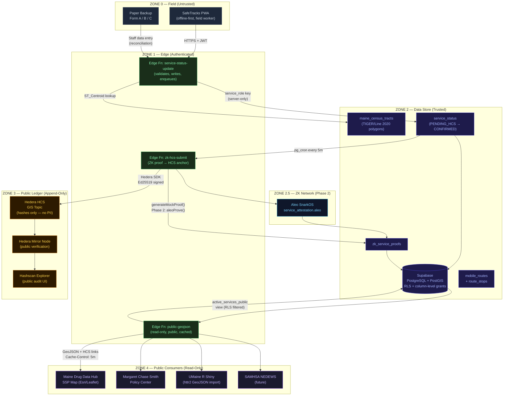
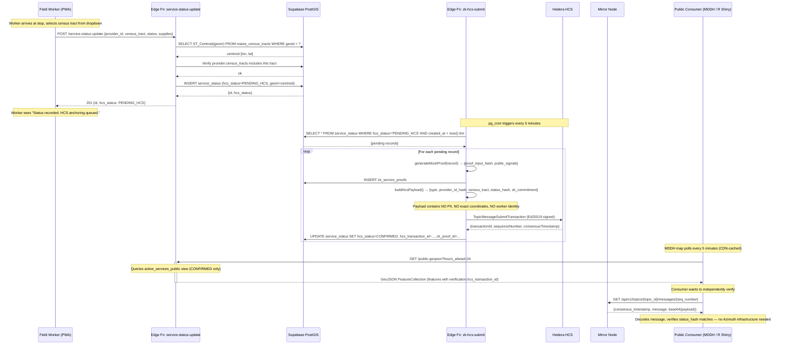

# Live Cryptographically-Verified GIS Layer
## Maine Drug Data Hub SSP Map Integration

**Classification:** Internal — Azimuth Foundation Inc.  
**Date:** July 2026  
**Status:** Phase 1 Implementation-Ready  
**Audience:** Kathryn Ballingall (Maine Drug Data Hub), Margaret Chase Smith Policy Center,
UMaine R Shiny team, Azimuth Engineering  

---

## Section 1 — High-Level Architecture



### Key architectural decisions

| Decision | Rationale |
|---|---|
| Census tract centroid as geometry | Prevents exact location inference; consistent with ADR-002; ST_Centroid derived server-side, never client-supplied |
| Categorical supply levels only | `well_stocked / low / out` — no exact inventory counts prevents back-calculation |
| Two-phase commit (PENDING_HCS → CONFIRMED) | Matches existing reconciliation-job.js pattern; ensures HCS anchoring is not lost on network failure |
| Separate HCS topic for GIS layer | GIS topic is publicly readable; sharps-collection topic is separate audit trail; avoids cross-contamination |
| `active_services_public` view | Centralizes all public projection logic; RLS on view; prevents raw PostgREST column access |
| Offline-first PWA | Rural Maine has spotty LTE; status updates queue to localStorage, flush on reconnect |
| Leaflet + OSM (no Mapbox) | No API key required; no third-party tile analytics; OSM open license |
| 5-minute CDN cache on GeoJSON | Reduces Supabase load from MDDH polling; stale-while-revalidate acceptable for 5-min operational cadence |

---

## Section 2 — Supabase Database Schema

See `supabase/migrations/001_gis_layer.sql` for the complete executable migration.

### Tables

| Table | Purpose | Geometry type |
|---|---|---|
| `service_providers` | Registered programs (SSP, outreach, FTIR) | None — census_tracts[] array |
| `mobile_routes` | Generalized route polylines with schedule | `geography(LineString, 4326)` |
| `route_stops` | Individual stop points (centroid only) | `geography(Point, 4326)` |
| `service_status` | Real-time status per window | `geography(Point, 4326)` — centroid |
| `zk_service_proofs` | ZK proof artifacts | None |
| `maine_census_tracts` | Reference polygons (TIGER/Line 2020) | `geography(MultiPolygon, 4326)` |

### Critical geometry invariant

A **database trigger** (`trg_service_status_geometry_check`) enforces that the
`geom` column in `service_status` and `route_stops` must be within 100 meters
of the authoritative census tract centroid from `maine_census_tracts`.

This prevents any client-supplied coordinate from leaking through — even if an
edge function were compromised, the DB would reject a non-centroid point.

```sql
-- Trigger rejects anything not within 100m of the TIGER/Line centroid
CREATE TRIGGER trg_service_status_geometry_check
  BEFORE INSERT OR UPDATE OF geom ON service_status
  FOR EACH ROW EXECUTE FUNCTION enforce_tract_centroid_geometry();
```

### RLS summary

| Role | `service_status` | `service_providers` | `zk_service_proofs` |
|---|---|---|---|
| `anon` | SELECT (CONFIRMED, non-cancelled, ≤24h) — `participant_count_band` **revoked** | SELECT (active only) — `contact_hash` **revoked** | SELECT (is_valid=true) — `proof_data` **revoked** |
| `authenticated` | SELECT (7-day window) + INSERT + UPDATE (today, non-final) | SELECT | SELECT (is_valid=true) |
| `service_role` | ALL | ALL | ALL |

### View: `active_services_public`

Pre-projects all public-facing fields including `ST_AsGeoJSON(geom)` and
Hedera Mirror Node verification URLs. The public GeoJSON edge function reads
only from this view, never from raw tables.

---

## Section 3 — Core Edge Functions

| Function | Path | Auth | Purpose |
|---|---|---|---|
| `service-status-update` | `POST /service-status-update` | Worker JWT | Validate + persist status; enqueue HCS |
| `zk-hcs-submit` | `POST /zk-hcs-submit` | Service-role only | Generate ZK proof; submit to HCS; confirm |
| `public-geojson` | `GET /public-geojson` | None | Public GeoJSON FeatureCollection |

See `supabase/functions/` for full TypeScript source.

### service-status-update key logic

```
Client JWT → validated by Supabase Auth (anon client)
  ↓
Input validation (census_tract format, window range, status enum)
  ↓
ST_Centroid lookup — geom derived from maine_census_tracts, NOT from client
  ↓
Provider census_tract authorization check
  ↓
Idempotency check (same provider × date × window_start → return existing)
  ↓
INSERT service_status (hcs_status = 'PENDING_HCS')
```

### zk-hcs-submit key logic

```
Fetch PENDING_HCS records older than 5 min (batch 50)
  ↓ for each:
generateMockProof(record) → {proof_input_hash, public_signals}
  ↓
INSERT zk_service_proofs
  ↓
buildHcsPayload() → {type, provider_id_hash, census_tract, status_hash, zk_commitment, window_start}
  ↓
TopicMessageSubmitTransaction → Hedera mainnet
  ↓
UPDATE service_status SET hcs_status='CONFIRMED', hcs_transaction_id=..., zk_proof_id=...
  ↓
200ms delay → next record
```

### pg_cron invocation

```sql
-- Invoke zk-hcs-submit every 5 minutes via pg_cron
SELECT cron.schedule(
  'gis-hcs-reconciliation',
  '*/5 * * * *',
  $$
    SELECT net.http_post(
      url     := current_setting('app.edge_functions_url') || '/zk-hcs-submit',
      headers := jsonb_build_object(
        'Content-Type', 'application/json',
        'Authorization', 'Bearer ' || current_setting('app.service_role_key')
      ),
      body    := '{}'::jsonb
    );
  $$
);
```

---

## Section 4 — PWA Frontend Components

### Component map

```
/map                     — Public read-only service map (Leaflet + OSM)
/worker/status           — Authenticated status update form
```

### ServiceStatusForm (`frontend/src/components/ServiceStatusForm.tsx`)

Key UX decisions:
- **No GPS prompt** — stop is selected from a dropdown of route stops (census tract + landmark name only)
- **Large tap targets** — minimum 44px touch target for cold/gloved hands
- **Offline banner** — shown when `navigator.onLine` is false; submit queues to localStorage
- **Offline sync** — `flushOfflineQueue()` called on `window.addEventListener('online', ...)`
- **Supply level buttons** — 3-state toggle per supply type; color-coded

### Map page (`frontend/src/app/map/page.tsx`)

Key UX decisions:
- **Max zoom: 13** — prevents users from zooming to street-address precision (centroid-only commitment)
- **Leaflet markers colored by worst supply level** — green/amber/red dot, immediately scannable
- **In-panel HCS verification** — "Verify on HCS" button calls Hedera Mirror Node API live; shows consensus timestamp
- **Cache-first on network failure** — last GeoJSON stored in sessionStorage; offline banner if stale

### R Shiny integration (UMaine)

```r
library(httr2)
library(sf)
library(leaflet)

# Pull verified GeoJSON — no auth required
response <- request("https://[project].supabase.co/functions/v1/public-geojson") |>
  req_headers(Accept = "application/geo+json") |>
  req_perform()

services_sf <- st_read(resp_body_string(response), quiet = TRUE)

# Render
leaflet(services_sf) |>
  addTiles() |>
  addCircleMarkers(
    color = ~ifelse(status == "active", "#10b981", "#f59e0b"),
    popup = ~paste0(
      "<b>", provider, "</b><br>",
      "Status: ", status, "<br>",
      "Narcan: ", supplies$narcan, "<br>",
      "<a href='", verification$verify_url, "' target='_blank'>Verify on Hedera ↗</a>"
    )
  )
```

---

## Section 5 — Hedera HCS + Aleo Integration

### HCS Topic structure

Two separate HCS topics are used:

| Topic | Content | Who reads |
|---|---|---|
| `HEDERA_TOPIC_ID` (existing) | Sharps-collection proof anchors | Auditors, grant agencies |
| `HEDERA_GIS_TOPIC_ID` (new) | Service status anchors | Public, SSP map consumers |

The GIS topic is intentionally public and readable by anyone with the topic ID.

### What the HCS GIS message contains

```json
{
  "type": "safetracks_service_status_v1",
  "provider_id_hash": "e3b0c44298fc1...",
  "census_tract": "23019030100",
  "status_hash": "a665a45920422f...",
  "zk_commitment": "7c222fb2927d82...",
  "window_start": "2026-07-02T17:00:00Z",
  "anchored_at": "2026-07-02T17:05:23Z"
}
```

**What is NOT included:** provider name, route name, exact geometry, worker identity,
participant count, supply exact quantities, any PII.

### Verification flow (public)

Anyone can verify a SafeTracks GIS record independently:

```bash
# 1. Get the HCS message (sequence number from the GeoJSON feature)
curl "https://mainnet-public.mirrornode.hedera.com/api/v1/topics/{TOPIC_ID}/messages/{SEQ}"

# 2. The response includes consensus_timestamp and base64-encoded message
# 3. Decode the message — must match the status_hash in the GeoJSON feature
# 4. No Azimuth infrastructure needed — verifiable by anyone with internet access
```

### Aleo Leo circuit (`aleo/circuits/service_attestation.leo`)

The Leo program `service_attestation.aleo` proves:

1. Worker has a valid authorization token (non-zero, device-bound)
2. Status claim matches the public commitment (`BHP256::hash_to_field(claim) == commitment`)
3. Supply levels are in valid categorical range (0–2)
4. Status category is valid (0–4)
5. Time window is internally consistent (`window_end > window_start`)

**Phase 1 (current):** `generateMockProof()` in `zk-hcs-submit/index.ts` — same
public signals schema, Groth16 mock via SHA-256.

**Phase 2 upgrade path:**

```typescript
// In zk-hcs-submit/index.ts, replace:
const proof = await generateMockProof(record);

// With:
const proof = await aleoProve({
  worker_auth_token: workerToken,  // device-bound secret
  claim: buildStatusClaim(record),
  commitment: computeCommitment(record),
  window_start: BigInt(new Date(record.window_start).getTime() / 1000),
  window_end:   BigInt(new Date(record.window_end).getTime() / 1000),
});
// public_signals schema is identical — no HCS payload or DB changes
```

---

## Section 6 — GIS Export

### GeoJSON FeatureCollection format

The `public-geojson` edge function returns RFC 7946 GeoJSON with additional
properties in each Feature's `properties` object:

```json
{
  "type": "FeatureCollection",
  "features": [
    {
      "type": "Feature",
      "geometry": {
        "type": "Point",
        "coordinates": [-68.7726, 44.8012]
      },
      "properties": {
        "id": "uuid",
        "provider": "SafeTracks Mobile — Bangor",
        "program_type": "mobile",
        "census_tract": "23019030100",

        "status": "active",
        "window_start": "2026-07-02T17:00:00Z",
        "window_end": "2026-07-02T21:00:00Z",
        "is_active_now": true,
        "delay_minutes": null,

        "supplies": {
          "narcan": "well_stocked",
          "syringes": "low",
          "fentanyl_strips": "well_stocked"
        },

        "verification": {
          "hcs_topic_id": "0.0.4821930",
          "hcs_transaction_id": "0.0.98765@1751472323.000000000",
          "hcs_sequence_number": 142,
          "consensus_timestamp": "2026-07-02T17:05:23.412Z",
          "verify_url": "https://hashscan.io/mainnet/topic/0.0.4821930",
          "mirror_node_url": "https://mainnet-public.mirrornode.hedera.com/api/v1/topics/0.0.4821930/messages/142",
          "zk_proof_id": "uuid",
          "zk_commitment": "7c222fb2927d828af22f592134e8932480637c0d",
          "zk_public_signals": {
            "status_commitment": "a665a45920422f...",
            "window_hash": "e3b0c44298fc1...",
            "route_code_hash": "5994471abb01...",
            "circuit_version": "0.1.0-mock"
          }
        },

        "updated_at": "2026-07-02T17:05:24Z"
      }
    }
  ],
  "metadata": {
    "generated_at": "2026-07-02T17:10:00Z",
    "record_count": 3,
    "hours_ahead": 24,
    "source": "SafeTracks · Azimuth Foundation Inc.",
    "privacy_note": "Coordinates are census tract centroids only. No participant or exact-location data.",
    "verification": "Each feature includes hcs_verify_url for independent tamper verification via Hedera Mirror Node.",
    "mirror_node": "https://mainnet-public.mirrornode.hedera.com/api/v1",
    "license": "CC BY 4.0 — attribution: Azimuth Foundation Inc. / Maine Drug Data Hub"
  }
}
```

### Route polyline export (for GIS import into Esri/QGIS)

```
GET /public-geojson?program_type=mobile

Returns LineString features for each active mobile route in addition to Point
features for individual status windows. Consumers can overlay the route polyline
as a separate layer from the status dots.
```

### Esri-compatible shapefile export

Staff can trigger a one-time export from the Supabase dashboard:

```sql
-- Export to CSV with WKT geometry for QGIS / Esri import
COPY (
  SELECT
    id,
    provider_name,
    census_tract,
    status,
    window_start,
    window_end,
    hcs_transaction_id,
    ST_AsText(geom::geometry) AS geom_wkt
  FROM active_services_public
  WHERE window_start >= now() - INTERVAL '7 days'
) TO '/tmp/safetracks_gis_export.csv' CSV HEADER;
```

---

## Section 7 — End-to-End Sequence



### Offline path (network unavailable)

```mermaid
sequenceDiagram
  participant W as Field Worker (PWA)
  participant LS as localStorage (device)
  participant SU as Edge Fn (when online)

  W->>SU: POST /service-status-update (network error)
  SU--xW: TypeError: Failed to fetch
  W->>LS: queueOffline(payload) → {id: "offline-...", queued: true}
  Note over W: Banner: "Saved offline — will sync when connected"

  Note over W,LS: Worker continues collecting; more updates queue

  Note over W: Network restored
  W->>W: window.addEventListener('online', flushOfflineQueue)
  loop For each queued payload
    W->>SU: POST /service-status-update
    SU-->>W: {id, hcs_status: PENDING_HCS}
  end
  W->>LS: Clear flushed items from queue
```

---

## Section 8 — Security & Compliance Checklist

### Privacy (42 CFR Part 2 + Maine Chapter 252)

| Check | Implementation | Status |
|---|---|---|
| No participant PII in any layer | `service_status` table has no participant-linked columns | ✓ |
| No worker identity stored | `shift_code` is opaque (e.g. "TUE-LATE-01"); JWT validated but not persisted | ✓ |
| Exact service address never published | Geometry enforced to be ST_Centroid of census tract — verified by DB trigger | ✓ |
| Census tract minimum granularity | `active_services_public` view returns only census tract centroid; max zoom 13 in map UI | ✓ |
| Supply counts categorical only | Enum constraint: `well_stocked / low / out` — no numeric inventory | ✓ |
| Small-cell suppression | `participant_count_band` column revoked from `anon` role; edge function omits it | ✓ |

### Cryptographic integrity

| Check | Implementation | Status |
|---|---|---|
| Status payload HMAC | `status_hash = HMAC-SHA256(canonical_payload, STATUS_HMAC_SECRET)` — server-side only | ✓ |
| Independent tamper verification | Any party can verify `status_hash` against HCS mirror node message | ✓ |
| ZK commitment on-chain | `proof_input_hash` included in HCS payload | ✓ |
| HCS topic write key held by Azimuth only | Hedera submit key = Azimuth operator key; no external party can write | ✓ |
| Geometry can only be centroid | DB trigger rejects any point > 100m from TIGER/Line centroid | ✓ |
| No client-supplied coordinates | `service-status-update` derives geom from PostGIS, ignores any client lat/lon | ✓ |

### Access control

| Check | Implementation | Status |
|---|---|---|
| Worker JWT required for writes | `service-status-update` validates JWT via Supabase Auth before any DB operation | ✓ |
| `service_role` key never in frontend | Only edge functions hold `SUPABASE_SERVICE_ROLE_KEY` | ✓ |
| Column-level RLS | `participant_count_band` revoked from `anon`; `contact_hash` revoked from `anon`; `proof_data` revoked from `anon` | ✓ |
| Public API is read-only | `public-geojson` is GET only; no auth, no writes | ✓ |
| PostgREST direct access blocked | `active_services_public` view is the only exposed surface; raw table access blocked for `anon` | ✓ |
| `zk-hcs-submit` service-role only | Checks `Authorization: Bearer $SERVICE_ROLE_KEY`; no public invocation path | ✓ |

### Compliance

| Requirement | How addressed |
|---|---|
| 42 CFR Part 2 (substance use confidentiality) | No participant identity, no session linkage to service status records |
| Maine Chapter 252 (harm reduction privacy) | Same as above; service-level data only, not participant-level |
| HIPAA §164.312(c)(1) — integrity | HCS provides cryptographic integrity; any modification is detectable |
| HIPAA §164.312(b) — audit controls | HCS GIS topic provides tamper-evident audit trail of all status updates |
| HHS Safe Harbor (45 CFR §164.514(b)) | Only census-tract-level geography, no coordinates enabling re-identification |
| ADA / Section 508 | Leaflet map has keyboard navigation; supply status shown as text + color |
| Open data license | CC BY 4.0 — attribution required; no data use restrictions for public health purposes |

### Threat mitigations (GIS-specific)

| Threat | Mitigation |
|---|---|
| Worker submits false census tract | Provider authorization check: provider.census_tracts must include submitted tract |
| Attacker supplies non-centroid geometry | DB trigger: `enforce_tract_centroid_geometry()` rejects on INSERT/UPDATE |
| Replay of stale status update | Idempotency check: `(provider_id, service_date, window_start)` unique constraint |
| HCS topic flooding | GIS topic has Azimuth operator key as only submit key; Edge Function rate limits write path |
| Public GeoJSON scraping to identify service patterns | Intentional — this data is public. Rural suppression: sub-5 participant tracts have count suppressed |
| Law enforcement subpoena for exact stop coordinates | Not stored anywhere — only census tract centroid. Court order cannot compel production of data that doesn't exist |

---

## Section 9 — Phase 1 MVP Implementation Plan

**Scope:** SafeTracks Tuesday–Friday routes + late-night routes (8 stops total).
**Duration:** 6 weeks. **Team:** 1 full-stack engineer + 1 ops.

---

### Week 1 — Infrastructure

| Task | Owner | Done when |
|---|---|---|
| Create Supabase project; enable PostGIS extension | Engineering | `SELECT PostGIS_Version()` returns result |
| Run `001_gis_layer.sql` migration | Engineering | All tables, triggers, RLS policies created |
| Load Maine TIGER/Line 2020 census tracts into `maine_census_tracts` from `backend/geodata/maine_tracts_2020.sqlite` | Engineering | `SELECT COUNT(*) FROM maine_census_tracts` returns 358 (all Maine tracts) |
| Create Hedera GIS HCS topic; store `HEDERA_GIS_TOPIC_ID` in Supabase environment | Engineering | Topic visible on Hashscan |
| Deploy 3 edge functions; verify health checks respond | Engineering | `GET /public-geojson` returns empty FeatureCollection |
| Create `service_providers` record for Azimuth SafeTracks Mobile | Engineering | `SELECT * FROM service_providers` returns 1 row |

---

### Week 2 — Route Data

| Task | Owner | Done when |
|---|---|---|
| Create `mobile_routes` records for TUE, WED, THU, FRI + late-night routes | Engineering + Ops | 8 route records in DB |
| Identify census tract for each of the 8 SafeTracks stops; insert `route_stops` | Engineering + Ops | 8 route_stop records; each stop verified against TIGER/Line centroid in QGIS |
| Validate geometry in QGIS: all centroids fall within correct county | Engineering | Visual QA pass |
| Update `service_providers.census_tracts` to include all tracts covered by routes | Engineering | Authorization check passes for all 8 tracts |

---

### Week 3 — Worker PWA

| Task | Owner | Done when |
|---|---|---|
| Add Supabase auth to SafeTracks PWA (worker login flow) | Engineering | Worker can sign in; session persists across page reload |
| Wire `ServiceStatusForm` to `/worker/status` route | Engineering | Form loads route stops; submit calls `service-status-update` |
| Test offline queue: toggle airplane mode; submit; reconnect; verify flush | Engineering | Flushed records appear in `service_status` with `hcs_status = PENDING_HCS` |
| Train 2 pilot workers on the form (15 min each) | Ops | Workers can submit without assistance |

---

### Week 4 — HCS + ZK Pipeline

| Task | Owner | Done when |
|---|---|---|
| Configure `pg_cron` to call `zk-hcs-submit` every 5 minutes | Engineering | Cron job visible in `cron.job_run_details` |
| Submit 10 test status updates; verify all reach `CONFIRMED` within 10 minutes | Engineering | All 10 records show non-null `hcs_transaction_id` |
| Verify each HCS message on Hashscan | Engineering | Each `hcs_transaction_id` resolves on Hashscan; payload matches `status_hash` |
| Verify mirror node API response decodes correctly | Engineering | `verifyHcsMessage()` in `gis-api.ts` returns `valid: true` for test messages |

---

### Week 5 — Public API + Margaret Chase Smith Policy Center Integration

| Task | Owner | Done when |
|---|---|---|
| Configure CDN caching (Supabase CDN or Cloudflare) on `public-geojson` | Engineering | Response includes `Cache-Control: public, max-age=300` |
| Share `GET /public-geojson` URL with Kathryn Ballingall's team | Ops | Team confirms GeoJSON loads in their Esri/Leaflet environment |
| Provide R Shiny integration snippet (see Section 4) to UMaine team | Engineering | UMaine team confirms `st_read()` succeeds |
| Document HCS verification steps for Maine Drug Data Hub | Ops | MDDH confirms they can independently verify a test record on Hashscan |
| Deploy `/map` page publicly; test on mobile (iOS Safari + Android Chrome) | Engineering | Map loads, markers render, supply colors correct, HCS verify button works |

---

### Week 6 — Pilot + Hardening

| Task | Owner | Done when |
|---|---|---|
| 2-week pilot: 2 workers submit status updates on live routes | Ops | ≥ 16 real status updates CONFIRMED on HCS (2 workers × 4 routes × 2 weeks) |
| Monitor `service_status` for any FAILED records; fix if needed | Engineering | 0 FAILED records at end of pilot |
| Verify public-geojson returns live data during active routes | Engineering + Ops | Real-time test during Tuesday route: `/map` shows correct stop as `active` |
| Performance: confirm `public-geojson` responds in < 500ms from CDN | Engineering | `curl -w "%{time_total}"` on CDN URL < 0.5s |
| Penetration test: attempt to extract exact coordinates via PostgREST | Engineering | All attempts return only centroid or are blocked by RLS |
| Handoff doc for Kathryn Ballingall's team | Engineering | Doc covers: GeoJSON URL, verification steps, R Shiny snippet, update frequency |

---

### Post-Phase-1 backlog (not in scope)

| Item | Target |
|---|---|
| Aleo `service_attestation.aleo` production deployment | Phase 2 |
| SAMHSA NEDEWS integration | Phase 2 |
| Historical trend API (7-day / 30-day route coverage rates) | Phase 2 |
| Esri ArcGIS Online live feed connector | Phase 2 |
| SMS alert when supply level drops to `out` | Phase 2 |
| Multi-organization enrollment (other Maine SSPs) | Phase 3 |

---

## Appendix: Environment Variables

| Variable | Used by | Description |
|---|---|---|
| `SUPABASE_URL` | All edge functions | Project URL |
| `SUPABASE_SERVICE_ROLE_KEY` | Edge functions only — never frontend | Full DB access |
| `SUPABASE_ANON_KEY` | Frontend + JWT validation | Public RLS-scoped access |
| `STATUS_HMAC_SECRET` | `service-status-update`, `zk-hcs-submit` | Signing key for `status_hash` |
| `HEDERA_ACCOUNT_ID` | `zk-hcs-submit` | Azimuth Hedera operator account |
| `HEDERA_PRIVATE_KEY` | `zk-hcs-submit` | Ed25519 private key — **never in frontend** |
| `HEDERA_GIS_TOPIC_ID` | `zk-hcs-submit`, `public-geojson` | HCS topic for GIS status anchors |
| `NEXT_PUBLIC_SUPABASE_URL` | Frontend | Exposed to browser (safe) |
| `NEXT_PUBLIC_SUPABASE_ANON_KEY` | Frontend | Exposed to browser (safe) |
| `NEXT_PUBLIC_SUPABASE_FUNCTIONS_URL` | Frontend | Edge functions base URL |

---

## Appendix: Reuse with Verified Restore

This layer is designed to compose with the Verified Restore project:

- `zk_service_proofs` uses the same `proof_input_hash` + `public_signals` schema as SafeTracks `zk_proofs` — a single ZK verification library works for both
- `hcs_status` state machine (`PENDING_HCS → CONFIRMED → FAILED`) is identical to `sharps_events.hcs_status` — the same reconciliation job pattern applies
- `maine_census_tracts` reference table is shared — no duplicate geometry imports
- The `active_services_public` view pattern can be replicated for Verified Restore's public-facing API
- `fraud-detection.js` Maine bounds check is reusable for validating any field-submitted census tract
