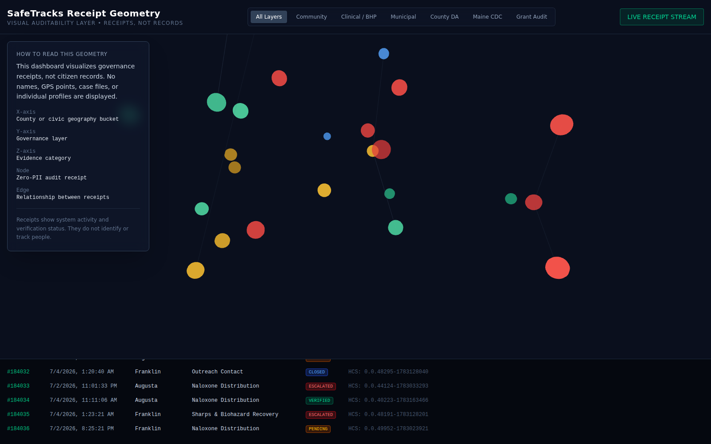

# SafeTracks Receipt Geometry

**Visual Auditability Layer for Public Health Receipts**

> Receipts, not records.

SafeTracks Receipt Geometry is a React + TypeScript + React Three Fiber MVP that visualizes public health field activity as a 3D graph of privacy-preserving governance receipts. It renders no names, no GPS points, no case files, and no individual profiles — only the shape and status of system activity.



A silent walkthrough recording is available at [`docs/demo-walkthrough.webm`](docs/demo-walkthrough.webm), with a narration script in [`docs/demo-script.md`](docs/demo-script.md).

---

## 1. What This Is

SafeTracks Receipt Geometry translates real-world public health activity — outreach visits, hazard reports, naloxone distributions, referrals, municipal responses — into non-identifying governance receipts that can be reviewed, filtered, and audited without exposing identity.

It is not the SafeTracks operating system. It is the **visual cockpit** sitting on top of a structured governance layer, showing how receipts move through verification: pending, verified, closed, or escalated.

The lifecycle it demonstrates:

```
Field activity → Zero-PII receipt → Governance coordinate mapping
→ 3D receipt geometry → Append-only ledger feed → Clickable audit receipt
```

## 2. Why "Receipts, Not Records" Matters

A **record** implies something kept on a person — a case file, a profile, a history that follows an individual. A **receipt** is proof that the system did work: a report was filed, a response was dispatched, a distribution occurred, a referral was made.

That distinction is the core of the governance model. This dashboard is designed so that cities, funders, and public health partners can verify that grant-funded work is happening and being closed out — without ever needing to see who was involved. Language throughout the app (receipt, audit receipt, governance receipt, verification status) is chosen deliberately to reinforce that boundary. Terms like "record," "case file," "subject," "citizen profile," "surveillance," or "tracking" do not appear anywhere in the product.

## 3. What the MVP Demonstrates

- A **3D receipt graph** where nodes represent zero-PII receipts and edges represent relationships between them (e.g., a Public Hazard Report closed by a Municipal Response).
- A **governance coordinate system**: geography bucket, governance layer, and evidence category as the X/Y/Z axes — never GPS.
- **Verification status** encoded as color and node size (pending, verified, closed, escalated), with node brightness fading as receipts age.
- A **live synthetic receipt stream** that appends new mock receipts every 3.5 seconds, simulating an append-only ledger.
- A **clickable inspector** that shows only receipt metadata: domain, category, spatial/temporal bucket, a synthetic proof reference, and general audit notes.
- Governance-layer **filters** (Community, Clinical/BHP, Municipal, County DA, Maine CDC, Grant Audit) that narrow both the graph and the ledger feed consistently.
- A bottom **ledger feed** showing sequence number, timestamp, bucket, category, status, and notarization reference, auto-scrolling to the newest receipt.

## 4. The Privacy Boundary

The application must never display:

- Names, addresses, phone numbers, or emails
- GPS coordinates or map-based location tracking
- Participant IDs or medical records
- Case notes about identifiable people
- Individual movement trails or tracking
- Law enforcement targeting or surveillance framing

Everything on screen is built from non-identifying buckets:

- County / civic geography bucket (not GPS)
- Temporal bucket (week/year, not exact timestamps tied to a person)
- Governance domain and evidence category
- Verification status
- A synthetic sequence number
- A synthetic proof hash and HCS timestamp placeholder
- General, non-identifying audit notes

The left-hand "How to Read This Geometry" panel states this boundary explicitly to anyone viewing the dashboard.

## 5. What Data Is Synthetic

All data in this MVP is mock data generated client-side in `src/utils/geometryMapper.ts`:

- Receipts are generated with `generateMockSafeTracksEvent`, randomly assigning a spatial bucket, governance domain, evidence category, and verification status.
- Timestamps are randomly distributed within the last 48 hours.
- `aleo_proof_hash` and `hcs_timestamp_placeholder` are synthetic strings shaped like proof references — they are **not** real cryptographic proofs and are **not** connected to Aleo or Hedera in any way.
- Audit notes are a fixed, non-identifying string: *"Zero-PII receipt generated via field operations. Identity abstracted at source."*
- No real names, addresses, coordinates, phone numbers, emails, or medical details are ever generated, by design.

## 6. Future Integrations Are Placeholders Only

The following are represented only as labels or placeholder fields in this MVP and are **not implemented**:

- **Aleo** proof generation/verification — `aleo_proof_hash` is a synthetic string, not a real proof
- **Hedera HCS** testnet or mainnet anchoring — `hcs_timestamp_placeholder` is a synthetic string, not a real notarization
- **Supabase** or any persistent backend/database — all state lives in browser memory and resets on reload
- **Field intake** from real outreach workers, hazard reports, or municipal systems — every receipt is generated client-side by a mock data generator; there is no ingestion pipeline, form, or API endpoint
- A real audit receipt schema or API
- Read-only public demo mode
- Exportable audit reports
- Grant reporting dashboards
- Multi-city/county live filtering against real data
- Role-based access views
- Municipal response workflow integration

None of these are wired up, and none should be without an explicit follow-up request — this MVP is the visual proof-of-concept only, with no live backend, no authentication, and no real public health integrations.

## 7. Running Locally

Requirements: Node.js 18+ and npm.

```bash
cd safetracks-receipt-geometry
npm install
npm run dev
```

Then open the URL printed in the terminal (typically `http://localhost:5173`).

- Click **LIVE RECEIPT STREAM** to pause/resume the synthetic feed.
- Click any node in the 3D graph to open the Zero-PII Audit Receipt inspector.
- Use the governance-layer filter buttons to narrow the graph and ledger together.
- Drag to orbit, scroll to zoom (powered by `@react-three/drei`'s `OrbitControls`).

## 8. Verified Build Commands

These commands have been run against this codebase and complete without errors:

```bash
npm install          # installs dependencies
npm run dev           # starts the Vite dev server with HMR
npx tsc -b             # type-checks the project with no errors
npm run build          # tsc -b && vite build — production build succeeds
```

The dev server was also exercised in a headless browser to confirm: the HUD renders, the seeded graph appears immediately, the live stream appends new receipts, the pause/resume toggle works, governance filters update the graph and ledger without crashing, node clicks open the inspector with only Zero-PII metadata, and the ledger auto-scrolls to the newest receipt.

## 9. Demo Script for Stakeholders

Use this script when presenting to a city official, public health partner, funder, or technical reviewer.

**Opening**

> This is SafeTracks Receipt Geometry. It is a visual auditability layer for public health work. It does not map people, track movement, or expose personal records. It shows receipts of system activity: reports, responses, referrals, distributions, and verification events.

**Core explanation**

> Each node is a zero-PII receipt. Each edge is a relationship between receipts. The X-axis is a civic geography bucket, the Y-axis is a governance layer, and the Z-axis is the evidence category. The bottom feed shows the append-only receipt stream.

**Privacy explanation**

> The design intentionally uses receipts, not records. A record sounds like something kept on a person. A receipt is proof that the system did work. That semantic difference is central to the governance model.

**Lifecycle story**

> Here is the lifecycle: a public hazard report appears in the community layer. A municipal response follows. The status moves toward verified or closed. The inspector shows a proof reference and audit notes, but no identity, address, or case file.

**Closing**

> The goal is not to create a surveillance dashboard. The goal is to make public health work auditable, fundable, and explainable without compromising personal privacy.

---

*SafeTracks / Azimuth Foundation — Receipts, not records. Governance geometry, not GPS. Auditability layer, not surveillance dashboard.*
